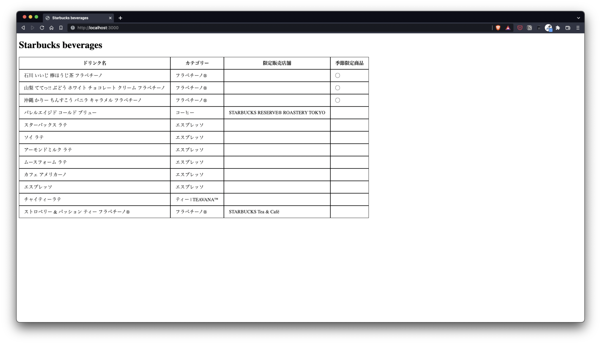

# Starbucks Beverage App

⚠️ このリポジトリは Code Chrysalis の生徒であるときに作成しました。

⚠️ This was created during my time as a student at Code Chrysalis.

## このアプリについて

Starbucks のドリンクを保存して表形式で表示することができます。



## 使い方

Database として Postgres を使用しています。

1. このリポジトリをクローンしてください

```
$ git clone https://github.com/kotaro-caffeinism/starbucks-api.git`
```

2. リポジトリに移動してください

```
$ cd starbucks-api
```

3. dependencies をインストールしてください

```
$ npm install
```

4. Postgres を使ってローカルで "starbucks" というデータベースを作成し、migration を実行してください

```
$ npm run migrate
```

5. `.env.local` ファイルを作成してください

```

SERVER_PORT=
DB_HOST=127.0.0.1
DB_PORT=5432
DB_NAME=starbucks
DB_USER=

```

6. アプリをスタートしてください

```
$ npm run start
```

## その他のコマンド

- テストデータの挿入

```
$ npm run seed
```

## 開発した機能

- データベースに格納しておいた飲み物のデータを Web ページに表示できます
- "/admin" にアクセスするとデータの更新・削除・追加ができます。フロントのフォームからだとうまく動かないため insomnia などで叩いてみてください

## 開発したかった（これからしたい）機能

- [ ] フロントからデータの更新・削除・追加ができる
- [ ] ドリンクの画像・アレルゲン・カロリーが表示できる
- [ ] ドリンクのカスタマイズシミュレーションができる
